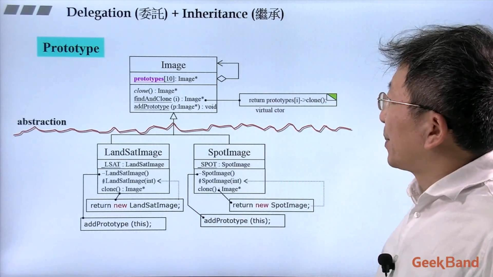

# 委托相关设计

## Composite

```c++
    class Component
    {
        int value;
    public:
        Component(int val) {value=val;}
        virtual void add(Component*){}
    };
```

```c++
    class Composite:public Component
    {
        vector<Component*>c;
    public:
        Composite(int val):Component(val){}

        void add(Component* elem){
            c.push_back(elem);
    }
    ...
    };
```

```c++
    class Primitive:public Component
    {
    public:
        Primitive(int val):Component(val){}
    };
```

## Prototype

### 现在设计的类如何创建未来出现的子类

子类中安排一个静态的自己的对象 会调用构造函数（设为private），构造中addProtype(this);
//继承自父类，子类将指针传给父类，子类中再准备一个函数clone():Image*->return new 子类
对象;父类中有clone（）的原型，以此创建子类。
父类中还有一个findAndClone(i):Image*当有需要的时候去寻找子类并clone一个子类对象。
clone是new一个新的子类对象但是构造会把新的子类对象加到父类中，因此还需要再写一个构造函
数(protected或者private)


